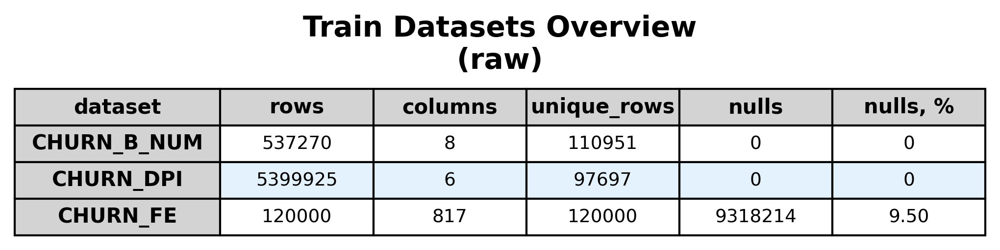
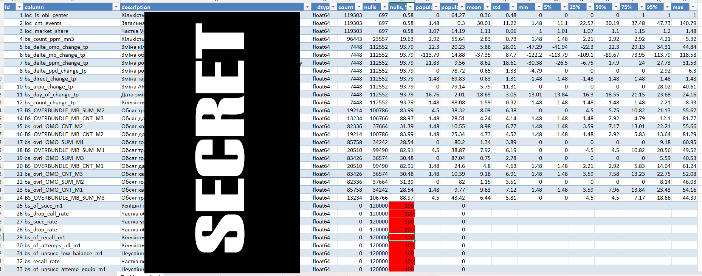
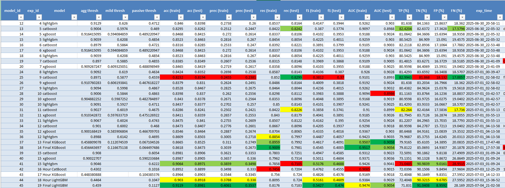
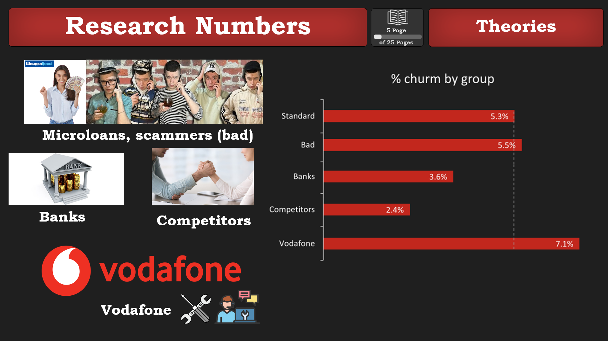
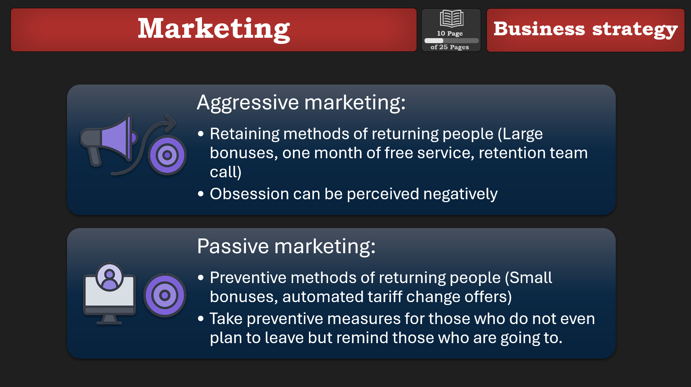
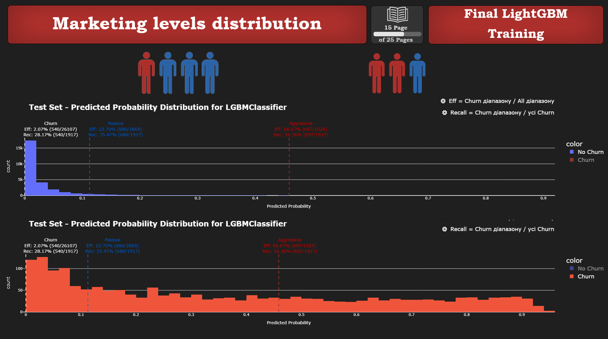
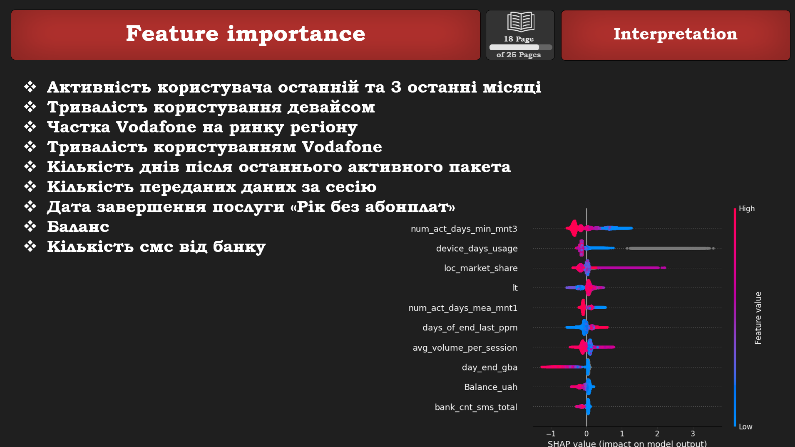

# BigData Churn predict
<!-- omit in toc -->
## Languages

---

<!-- omit in toc -->
## Frameworks

---

<!-- omit in toc -->
## Table of Contents
- [Introduction](#introduction)
- [🎯 Project Goals](#-project-goals)
- [📊 Data Description](#-data-description)
- [⚙️ Automatization](#️-automatization)
- [🔬 Research Numbers Dataset](#-research-numbers-dataset)
- [💡 Marketing Strategy](#-marketing-strategy)
- [🏆 Feature Importance](#-feature-importance)
- [📈 Results](#-results)

## Introduction
The final project of [BigDataLab](https://www.bigdatalab.com.ua/) course.

## 🎯 Project Goals

- Identify subscribers who will leave the service in 2 months and interpret the reasons for their churn.
- Achieve model training requirement:  
  **AUC metric ≥ 0.89**

---

## 📊 Data Description

---

## ⚙️ Automatization with Excel

- Automated data profiling was performed to identify outliers and missing values.

  

- Model saving and evaluation metrics were automated for quick retrieval.

  

---

## 🔬 Research Numbers Dataset

It was hypothesized that customer churn could be influenced by interactions with the following groups of subscribers:
- Microloans and scammers
- Banks
- Competitors
- Vodafone services and support

---

## 💡 Marketing Strategy

Passive and aggressive strategies for customer retention were proposed to ensure efficient use of resources.

---

## 🏆 Feature Importance

---

## 📈 Results

- A LightGBM model was designed that effectively distinguishes between subscribers who are likely to churn in 2 months and those who will remain.
- The model identifies more than **70%** of subscribers who are likely to churn.
- Achieved **AUC metric of 0.902 ≥ 0.89**, meeting the task requirement.
- Proposed effective aggressive and passive business strategies for customer retention.
- Investigated key factors influencing customer churn:
  - Customer activity
  - Customer balance
  - Vodafone's market share in the region
  - Bank usage activity
- Found that not all subscribers who churn are worth the cost of retention.
- Discovered that some subscribers churn unexpectedly, regardless of the service.

---

  <i>Made with ❤️ by BigDataLab students</i>

